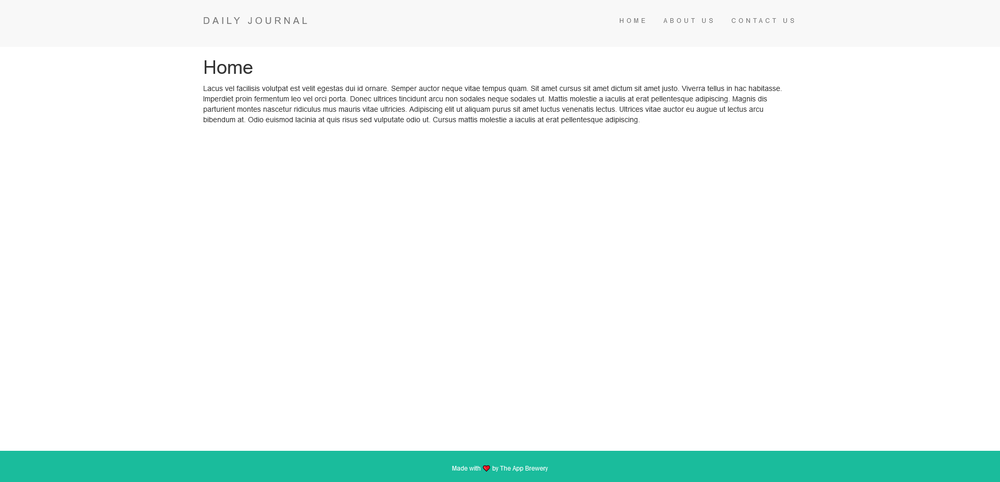

  [](https://twitter.com/intent/follow?screen_name=azeeez_ebrahim)

<div align="center">


  <h2 align="center">simple blog using ejs</h2>

This is a very simple blog websites using ejs and node js without database

</div>

<br />

## Demo



## Prerequisites

Before you begin, ensure you have met the following requirements:

* [Git](https://git-scm.com/downloads "Download Git") must be installed on your operating system.

## Installing Ejs-blog-wihtout-database

To install **Ejs-blog-wihtout-database**, follow these steps:

Linux and macOS:

```bash
sudo git clone https://github.com/AzeezEbrahim/Ejs-blog-wihtout-database.git
```

Windows:

```bash
git clone https://github.com/AzeezEbrahim/Ejs-blog-wihtout-database.git
```

## To run it

open terminal and type the following:

```bash
npm i
node app.js
```


## Contact

If you want to contact me you can reach me at [Twitter](https://www.twitter.com/azeeez_ebrahim).

## License
This project is free to use .
